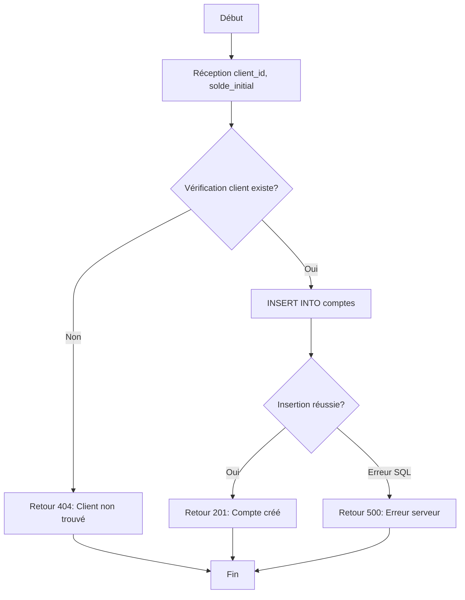

```mermaid
flowchart TD
    A[Début] --> B[Réception client_id, solde_initial]
    B --> C{Vérification client existe?}
    C -->|Non| D[Retour 404: Client non trouvé]
    C -->|Oui| E[INSERT INTO comptes]
    E --> F{Insertion réussie?}
    F -->|Oui| G[Retour 201: Compte créé]
    F -->|Erreur SQL| H[Retour 500: Erreur serveur]
    D --> I[Fin]
    G --> I
    H --> I
```