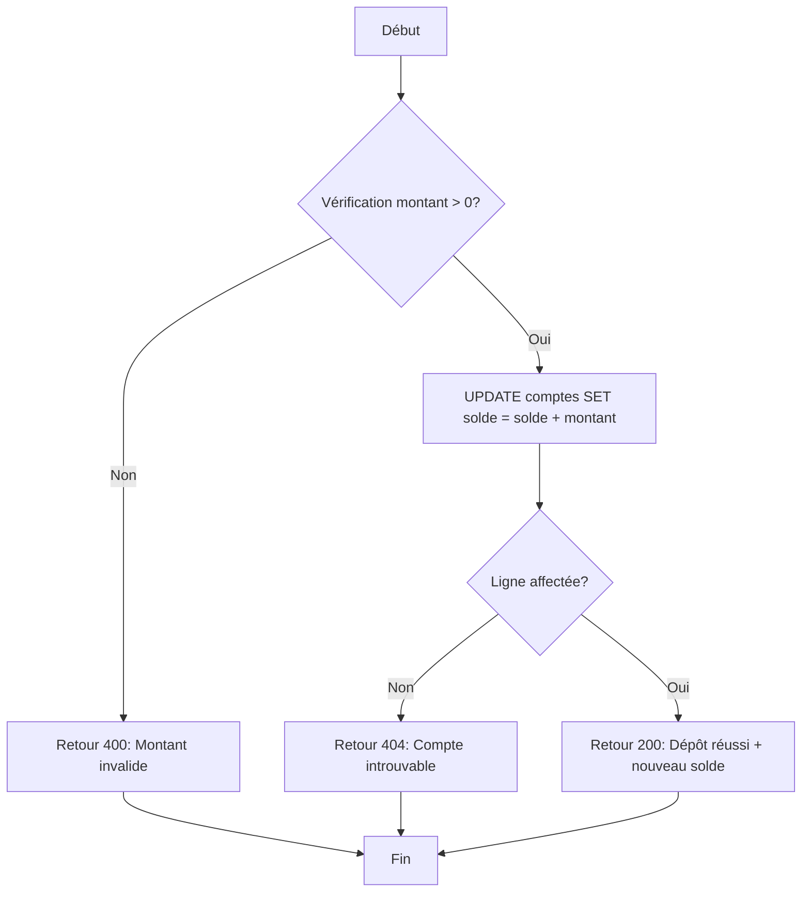

```mermaid
flowchart TD
    A[Début] --> B{Vérification montant > 0?}
    B -->|Non| C[Retour 400: Montant invalide]
    B -->|Oui| D[UPDATE comptes SET solde = solde + montant]
    D --> E{Ligne affectée?}
    E -->|Non| F[Retour 404: Compte introuvable]
    E -->|Oui| G[Retour 200: Dépôt réussi + nouveau solde]
    C --> H[Fin]
    F --> H
    G --> H
```