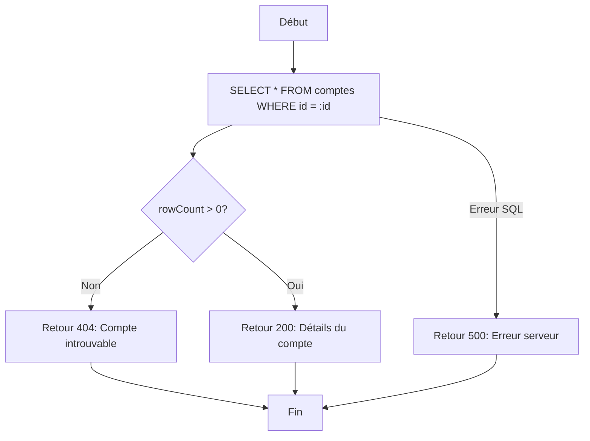

```mermaid
flowchart TD
    A[Début] --> B[SELECT * FROM comptes WHERE id = :id]
    B --> C{rowCount > 0?}
    C -->|Non| D[Retour 404: Compte introuvable]
    C -->|Oui| E[Retour 200: Détails du compte]
    B -->|Erreur SQL| F[Retour 500: Erreur serveur]
    D --> G[Fin]
    E --> G
    F --> G
```