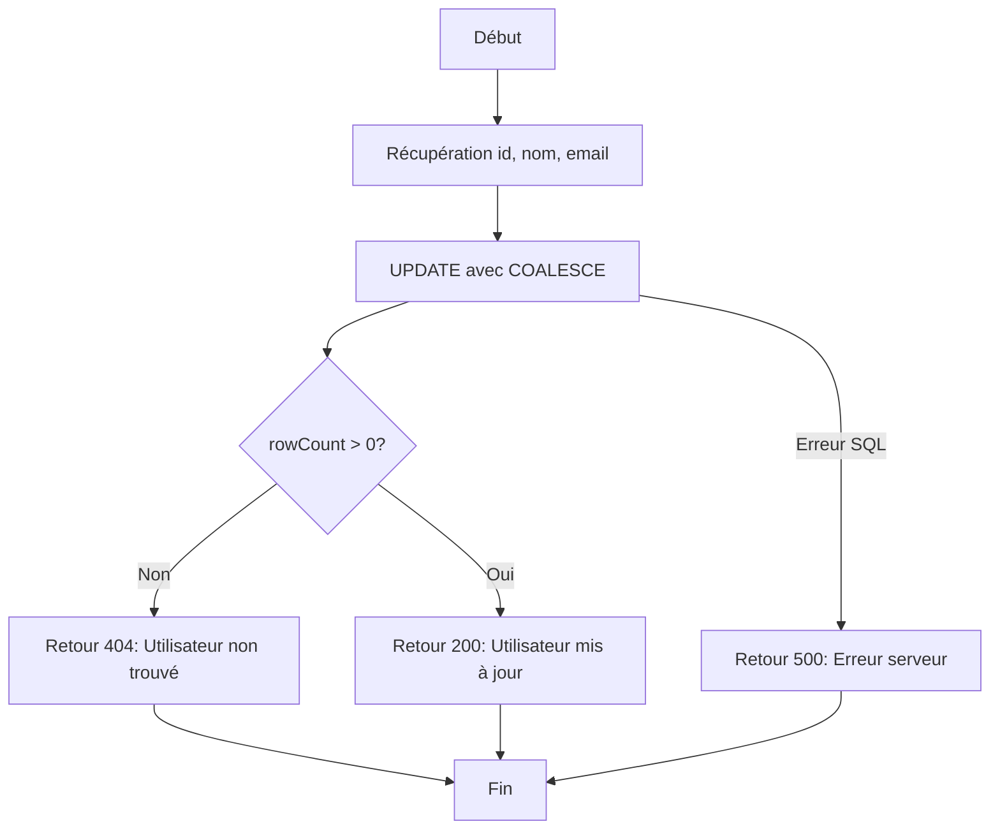

```mermaid
flowchart TD
    A[Début] --> B[Récupération id, nom, email]
    B --> C[UPDATE avec COALESCE]
    C --> D{rowCount > 0?}
    D -->|Non| E[Retour 404: Utilisateur non trouvé]
    D -->|Oui| F[Retour 200: Utilisateur mis à jour]
    C -->|Erreur SQL| G[Retour 500: Erreur serveur]
    E --> H[Fin]
    F --> H
    G --> H
```