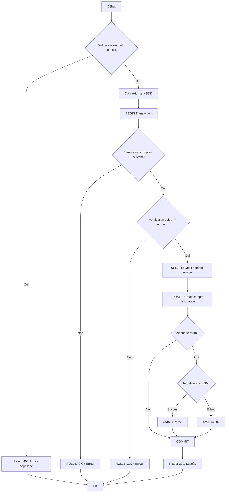

```mermaid
flowchart TD
    A[Début] --> B{Vérification amount > 500000?}
    B -->|Oui| C[Retour 400: Limite dépassée]
    B -->|Non| D[Connexion à la BDD]
    D --> E[BEGIN Transaction]
    E --> F{Vérification comptes existent?}
    F -->|Non| G[ROLLBACK + Erreur]
    F -->|Oui| H{Vérification solde >= amount?}
    H -->|Non| I[ROLLBACK + Erreur]
    H -->|Oui| J[UPDATE: Débit compte source]
    J --> K[UPDATE: Crédit compte destination]
    K --> L{telephone fourni?}
    L -->|Oui| M{Tentative envoi SMS}
    L -->|Non| N[COMMIT]
    M -->|Succès| O[SMS: Envoyé]
    M -->|Échec| P[SMS: Échec]
    O --> N
    P --> N
    N --> Q[Retour 200: Succès]
    C --> R[Fin]
    G --> R
    I --> R
    Q --> R
```