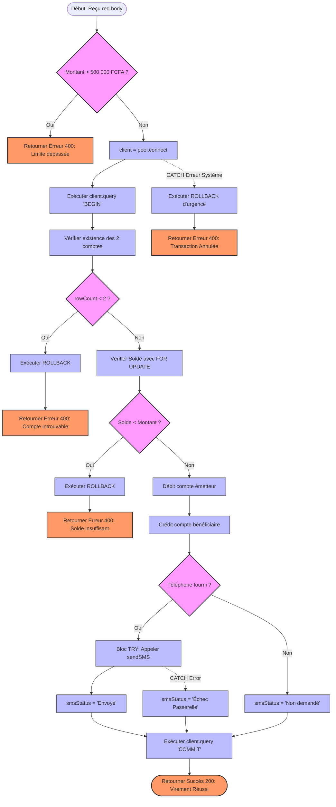

# 📊 Graphes de Flot de Contrôle (Control Flow Graphs) - INF3521

Ce document regroupe la modélisation structurelle de la logique métier de l'API bancaire. Chaque graphe met en évidence les nœuds de décision (points de branchement conditionnels) et les blocs d'instructions linéaires.

---

## 1. CFG du Point d'accès : Virement Interne (`POST /transfer`)
Ce graphe représente l'endpoint le plus complexe du système, illustrant la validation du plafond, les verrous de concurrence et la tolérance aux pannes du service SMS.

